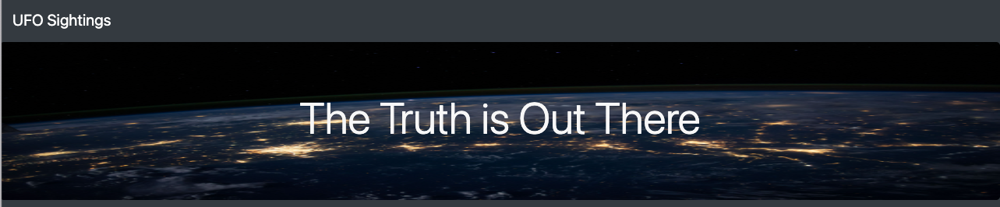
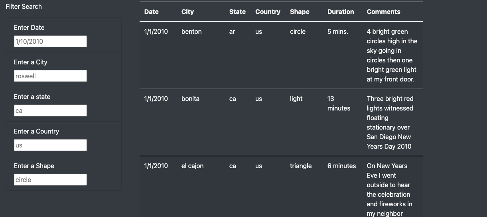
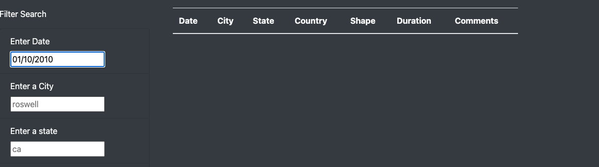
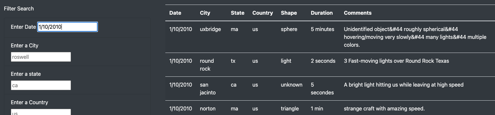

#  UFO Sightings with JavaScript

## Overview of the analysis:

The purpose of our webpage is to create a filterable table from our data set of UFO sightings.  Our table has the ability to be filtered by date, city, state, country, as well as shape.

    

## Results:
 ### How to Perform Search
  Using the filter search box, users can filter our data set by date, city, state, country, or shape.  The table will update if the user presses tab or enter.  Use the multiple search criteria to filter data based on your needs.  If you want to remove a filter simply delete the text from the filter and click tab or enter.
   
     
## Summary:

 ### Drawbacks
- One drawback from this webpage is that the filters have to be exact.  For example if we filter by the date 1/10/2010 we will see results however if we filter by 01/10/2020 we will not retrieve any data

     
     
    
 ### Additional Recommendations for future development
- One recommendation would be to seperate the month and year into there own filters to provide more flexibility for filtering data

- Another recommendation would be to make the table sortable.
